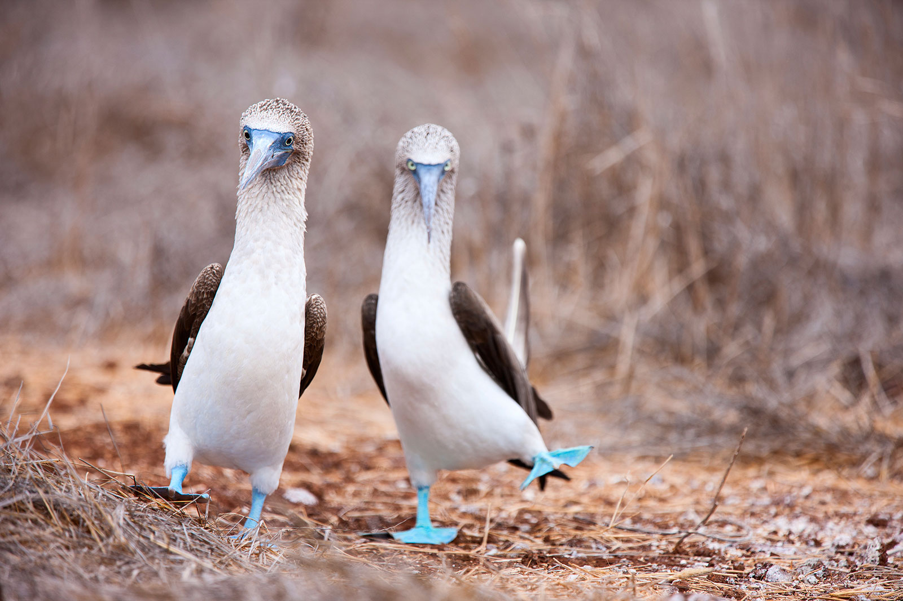

It’s the loud upstart that’s burst onto the App Store with all guns blazing and a bit of a scandal to boot. A month after launch we’ll take a look at Periscope’s vision versus its real application in the big bad world.

<!-- end -->

Oh the publicity! Everything seems to have been orchestrated to Periscope’s advantage. They have the competition with another app to generate debate and the scandal about how they have treated them – so what did actually happen?

## Periscope: The Scandal

Just before Periscope – Meerkat launched on 27 February this year (rather quietly) after a reported 8 weeks in development as a side project. It paired up video streaming with twitter by enabling video links to be tweeted and responding comments to appear on twitter. Within a month the media had seized on it as the big new thing that would revolutionise US journalism. Wow! But there was a catch, it wasn’t *that* much of a sensation – it just had [success at one festival](http://www.theverge.com/2015/3/17/8234769/how-meerkat-conquered-all-at-sxsw). At its absolute peak it ranked at 140 in the US iPhone download chart so it seems that celebs and the media were the *only* ones on the Meerkat bandwagon.

Unfortunately for Meerkat even during the festival the writing was already on the wall. On 13 March Twitter hit them with a double whammy announcing the acquisition of Periscope and that they were limiting Meerkat’s access to their social graph. The social graph was pretty crucial – it helped people find videos to watch based on who they were currently following on twitter – so it was a little like dropping a grand piano on a very small meerkat.

Amazon’s drone delivery service still has its teething problems

Meerkat ramped up the battle by choosing to make a rather big announcement on 26th March – the same day Periscope was launched. Whether this was supposed to be payback and/or a diversion tactic it misfired. In practice by announcing the huge investment of $14 million on the same day it generated even more publicity for Periscope’s launch – as a nemesis. Periscope peaked the in the US iPhone download chart at no. 87 the very next day. This is the highest it ever reached and on Meerkat’s one month anniversary – ouch!

## **What’s the Dream Stream?**

The idea behind Periscope was formed in 2013. [Kayvon Beykpour](https://www.crunchbase.com/person/kayvon-beykpour) was travelling to Istanbul and shortly before leaving learned that there were protests near his hotel. He wanted to know how safe it was to go there but the information coming out of Istanbul was disjointed. He wanted to know how dangerous this was from people who were actually there and so the idea for Periscope was born.

As well as spreading crucial information during times of crisis there is also a more light-hearted angle to Periscope; building common understanding between people living all over the world. The word teleportation is used repeatedly – but Hiro Nakamura probably hasn’t got anything to worry about just yet.

So far it has been used by David Blaine to do magic tricks, break news of an explosion at 121 Second Avenue in New York City and by Seth Meyers to stream the ‘Late Night’ show from the set but mostly it’s been the domain of the bored.

## **The Real Stream – Limitations**

Periscope warns in its [Terms of Service](https://www.periscopeapp.co/tos) (Section 9) that it will respond to notices of alleged copyright infringement and reserves the right to suspend peoples’ accounts. So that eliminates TV and film, this might seem somewhat obvious but apparently not to the Game Of Thrones fans who decided to stream the season 5 premiere.

**Let’s also count out:**

- Broadcasting on private property without the consent of the owner;
- Broadcasting someone as the main subject when they do not agree;
- Broadcasting someone who reasonably expects that they are in a private place and has not consented to be filmed.

Strict? Well yes, but there is no leeway to get consent later – it’s live at the time of filming and out there immediately.

Also because it’s live you need to have some balls to start broadcasting – what if you are going to ask someone to marry you and they say no? You *can* say it’s only available during the broadcast (or for 24 hours afterwards if you select this option) but we all know this is a lie. It is kept and stored deep down in those dark twitter servers and they reserve the right to do pretty much anything they want with it (Section 5) and that includes sending it to anyone they want…

> By submitting, posting or displaying Content on or through Periscope, you grant us a worldwide, non-exclusive, royalty-free license (with the right to sublicense) to use, copy, reproduce, process, adapt, modify, publish, transmit, display and distribute such Content in any and all media or distribution methods (now known or later developed).
>
> You agree that this license includes the right for Twitter… to make Content submitted to or through Periscope available to other companies, organizations or individuals who partner with Twitter, Inc. for the syndication, broadcast, distribution or publication of such Content on other media and services, subject to our terms and conditions for such Content use.

Given all this and the fact you need to have wi-fi or a decent phone signal, it suddenly becomes apparent why it’s mostly people filming their pets or their own random monologue.

## **The Real Stream – It’s an Open Party**

By default you broadcast to everyone. Whilst this gives Periscope a broader appeal it also makes it ripe for abuse. As you begin filming your video on Periscope it streams immediately and is accessible to its worldwide audience.

This brings us onto the other more predictable request: boobies.

Blue Footed Boobies: A surprisingly popular breed of bird on Periscope

Pornographic or overtly sexual content cannot be posted according to Pericope’s [Content Policy](https://www.periscopeapp.co/content) nor can images showing direct violence or threatening it. But every broadcast I have seen involving any female below 30 has generated sexual requests – this is sadly predictable. When the audience member is completely hidden and the “presenter” is immediately visible – as is their reaction, it’s a recipe to bring out the darker side of people.

For this reason young women should think very carefully before broadcasting with this app and watch the broadcasts of other women to become aware of the comments they may face. If they are vulnerable or unprepared it may be a shock and if they are suggestible it could be much worse.

The potential for trolling is pretty worrying, especially when teamed with Twitter’s track record regarding monitoring content. Admittedly it is a huge task but when their own [CEO admits](http://www.theguardian.com/technology/2015/feb/05/twitter-ceo-we-suck-dealing-with-trolls-abuse) that they consistently suck at dealing with trolls and abuse you have to wonder how this is going to play out.

The potential breadth of Periscope and its vision for a more accessible world is noble and inspiring but this type of broadcast will be somewhat rare. Its everyday use is more mundane; chaotic glimpses behind the scenes in news studios, a social gathering that’s not quite audible, a dog looking at the camera. These are the low risk everyday events that are within the “rules” and low risk from trolls – dare I say because they are boring?

Low risk and low interest is probably going to be its staple diet, perhaps it will develop a more specific interesting and use through the evolution of a broadcasting culture. However, if Twitter is anything to go by the signal-to-noise conundrum will mean that if it does take off, you’ll have to wade through an awful lot of pet videos to get to the hidden treasures.

So is it going to take off? Well fast forward from their launch date to the first weekend in May and Periscope is still within top 100 in the US iPhone download chart whilst Meerkat is fighting to stay within top 1000 (967 on Saturday, 1024 on Sunday). Periscope is not exactly a runaway success but it is hanging in there – albeit as the hangout of the bored. For better or for worse with the power of twitter behind it and its good start it should be sustainable, especially when taking into account their devotion to eliminating the competition.

### Interesting reading

The ideals behind Periscope: [http://wrd.cm/1HKqKft](http://wrd.cm/1HKqKft)

Meerkat-Vs-Periscope: [http://bit.ly/1NtZyjq](http://bit.ly/1NtZyjq)

How Periscope could be used to prevent violence: [http://bit.ly/1IL3qO0](http://bit.ly/1IL3qO0)