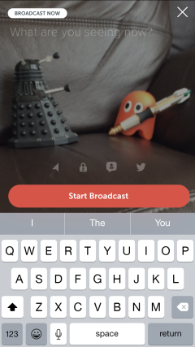
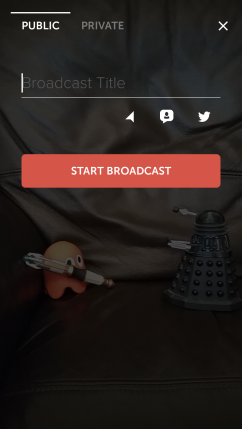
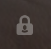
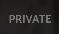
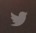

## Essential Information Before You Periscope

| Beginning at the Periscope homepage, you tap on the camera icon and enable your camera, microphone and location. |                                                          |
| ------------------------------------------------------------ | -------------------------------------------------------- |
| **Camera icon on Home screen**                               |                                                          |
| iPhone                                                       | Android                                                  |
|  Third along the bottom  |  Bottom right corner |
| **The Broadcast screen**                                     |                                                          |
| iPhone                                                       | Android                                                  |
|                          |                      |

By default you are set to broadcast to EVERYONE LIVE. If you want to broadcast to only certain people then tap on the privacy icon and select the people you want to limit the broadcast to – you can only select people who already ‘Follow’ you within Periscope. Beware – whether you chose Public or Private it is going out live– you can’t change that setting!

| **The privacy icon**                                         |                                                              |
| ------------------------------------------------------------ | ------------------------------------------------------------ |
| iPhone                                                       | Android                                                      |
|  Middle of the Broadcast Screen |  Top of the Broadcast Screen |
| **Twitter**                                                  |                                                              |
| iPhone                                                       | Android                                                      |
|  Middle of the screen    |  Middle of the screen    |

Do you want all of your twitter followers to be alerted to your first broadcast? If you have an iPhone then by default that tweet will go out and you’ll need to tap on the bird emblem to switch this off. If you have an android phone then by default it should already be switched off but best to check!

If you want to block someone for making unsuitable comments during a broadcast then tap on their comment and you will have this option. You will probably get sexual comments if you are female. If you are easily upset, you can tap on the speech bubble and only those people who you follow on Periscope will be able to send comments to you.

| **The comment blocker**                                      |
| ------------------------------------------------------------ |
|  Middle of the Broadcast Screen |

You must give your stream a title. Start typing when you are on this screen and it’ll appear at the top.If you want to flip the camera to face you tap the front of the phone twice or swipe down and click on the camera icon.

| **Front facing camera**                                      |
| ------------------------------------------------------------ |
| Swipe down during Broadcast |
| **Stop broadcasting**                                        |
| Swipe down during Broadcast to access this. |

At the end of your stream the video will be saved by default for 24 hours and will be available to everyone on the original settings, i.e. if it was private amongst a few people then the saved version will be as well – if it was public it remains ‘out there’ for 24 hours after which time it’ll disappear. If you wish to delete it immediately you can.

| **Delete broadcast**                                         |                                                              |
| ------------------------------------------------------------ | ------------------------------------------------------------ |
| iPhone                                                       | Android                                                      |
|  Swipe down after Broadcast |  Bottom Corner then the option to delete will appear |

### Additional Information

Your location sharing will probably be switched on as default if you have an iPhone (not so much on android). This is not as much of an issue as it might seem. It is accurate enough to pinpoint the district you are in but not much more than that. When Periscope was first released it pinpointed what road you were on and got changed after it received complaints.

If you want to switch the location sharing off then tap the arrow on the left just above “Start Broadcast”.

One last point before you start broadcasting to the world. Make sure you are prepared for the power of the Internet to enter your own personal space; whilst you are videoing, people can make comments to you and they’ll appear on your screen. This is a very useful feature for interaction but it also makes it perfect for trolls. Not only can they make spiteful/unwanted sexual comments but they can be certain that they reach their recipient – instantly – and they get to see the reaction and the effect their comments have on the broadcaster.

Don’t be scared just be aware. Mostly Periscope is the domain of the bored.

## Other Peoples’ Broadcasts

When watching someone else’s broadcast, you can send them a heart by touching the screen. Hearts fulfil four functions:

1. The more hearts your broadcast gets the higher up it sits in the “Most Loved” list.
2. They tell the person that is broadcasting that you like what they are doing and so encourage them.
3. They rank people (!) Just like twitter followers denote twitter success the number of hearts a person has received indicate their popularity. (There are periscope followers as well but enough people are not really on it yet to make a judgement call based on these.)
4. They let you see what other people think of videos you are watching – if someone is filming their feet and the hearts are going nuts you get to know it isn’t a rubbish video – it just isn’t your thing.

You can get more information about the broadcast by swiping left to right on an iPhone and from the bottom to the top of an android phone. This shows you where the broadcaster is and who else is viewing the broadcast. In this newly discovered area you will also find the option to hide other peoples’ comments from flashing across the broadcast and the ability to report an unsuitable broadcast. This is accessed by scrolling to the bottom of this area on the iPhone or clicking on the kebab menu () if you are on android.

## A Note for Parents

Periscope is monitored by Twitter but they do not have the best [track record ](http://www.theguardian.com/technology/2015/feb/05/twitter-ceo-we-suck-dealing-with-trolls-abuse)at monitoring and as the numbers grow this will get more difficult. Periscope is live which takes the stakes to a whole new level since broadcasts need to be monitored instantaneously to make sure the party doesn’t get out of hand or inappropriate. Parents beware: this is really where you should step up and investigate how your kids use this new app.

So what’s the worst that can happen? Well, broadcasters may subject their audience to extreme acts that they are not prepared for (adults and children) or worse they may be coerced into acts they were not prepared for. It is an app of interaction with comments and peer pressure and all the power that can exert on an impressionable kid. The app also comes with the ‘reassurance’ that after 24 hours it ceases to exist but in practice any adult knows that this is not a certainty in the real world. If you are determined enough you can save the broadcasts now.

So what should you do? The best thing is to make your kids aware of how they can make their broadcasts private and to encourage them to discuss their use of Periscope with you, so that if they do encounter anything that makes them uncomfortable they can talk to you about it. If you have an awareness of Periscope and how it works this will make those conversations all the easier.

In short, Periscope is a reflection of the Internet and all the people who use it; so that covers pretty much everyone. It has its aspirations to convey important information about what is going on in distant lands, the challenges other people face and how beautiful the world can be. It also has a less-than-enlightened side where the audience clamour to be flashed and mean comments are made. It has been made with everyone in mind – it’s super easy to get started. The rest is entirely down to its users – so use it wisely!