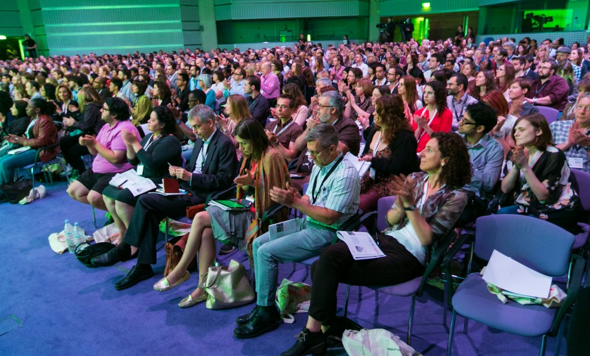

When Alex and I discovered tickets were available to the TEDx event in London this year, we got pretty excited – we are huge fans of these legendary talks and couple this with an evening event at the Houses of Parliament and you have yourselves a deal for sure!

<!-- end -->

If you have not heard of TED before, they run regular world-wide conferences where experts talk on a wide range of topics with the central theme of “ideas worth spreading” and make them available [online](http://www.ted.com/) for free.

So on Friday 27th June we hopped on the train to London and got ready for today’s topic: Democracy and Representation. Can you spot us?

 

We were captivated by the different perspectives given by each speaker ranging from the situation in Burma by Aung San Suu Kyi right through to Julian Treasure’s solution to the erosion of meaningful communication.

There were too many wonderful talks to mention them all but for a taster of our favourites see the smorgasbord below:

## Rick Edwards

Rick Edwards (yes, him off the telly) blew us away with his straightforward, compelling answer to get the young voting. It now seems more remarkable that this system is not already in place.

## Shaimaa Khalil

Shaimaa Khalil from the BBC World Service gave a truly moving talk about the revolution in Egypt and its ramifications on her team. It made us reflect that there is rarely an end to anything and the need to continually educate yourself.

## Ida Auken

Ida Auken spoke about her Open Ministry for the Environment in Denmark and the benefits of involving the key people in calculating solutions. Without assuming from the beginning that you already know who those key people are!

## Brooke Jazz Lawrence

We fell a little bit in love with Brooke Jazz Lawrence, she has a phenomenal voice and stage presence – one to watch!

## Matt Forde

Matt Forde’s comedy provided light relief. His love of politics shone through as he drew us into his world where Nick Clegg, Tony Blair and a ‘Northern Trade Union Rep’ read Winnie the Pooh. They’re in for a treat at the Edinburgh Festival!

## Anthea Lawson

Anthea Lawson took us on an international journey to corruption in the developing world; unfortunately it was a return ticket back to London where the money is hidden and court enforced. If you only watch one video watch this one.

##  Steve Richards

Steve Richards is truly gifted. Not only did he MC the event from start to finish, he also gave a riveting talk that actually made us feel sorry for politicians. If you need a bird charmed from a tree this might just be your man.

## Guy Browning

Guy Browning inspired us with his outrageous optimism; detailing how this helped him make his first ever film which premiered in Leicester Square(!) All done using the simple power of asking people and rolling the red carpet out for them, making them want to return the gesture

Who knew sitting in dark room could be so energising? We left the talks feeling revitalised and full of ideas. It was much more informative than browsing the Internet since you tend to gravitate towards your usual authors with similar interests and views. Being in the talks exposed us to a wide array of different ideas and perspectives, which are normally outside our subscriptions. It is for this reason we would recommend attending a talk if you get the chance.

You’ll probably be more surprised at the things that interest you than the actual details you learn.

If you would like to see any of these talks they are currently available [online](https://www.youtube.com/playlist?list=PLsRNoUx8w3rPidSDcpi0SMAJjGLww6UQP), along with the others we couldn’t quite squeeze in to this article!

All photos above, including beautiful header image, courtesy of the talented [Mr Paul Clarke.](http://paulclarke.com/)