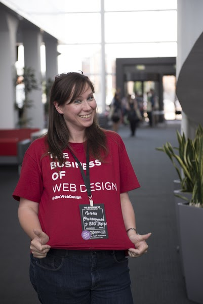
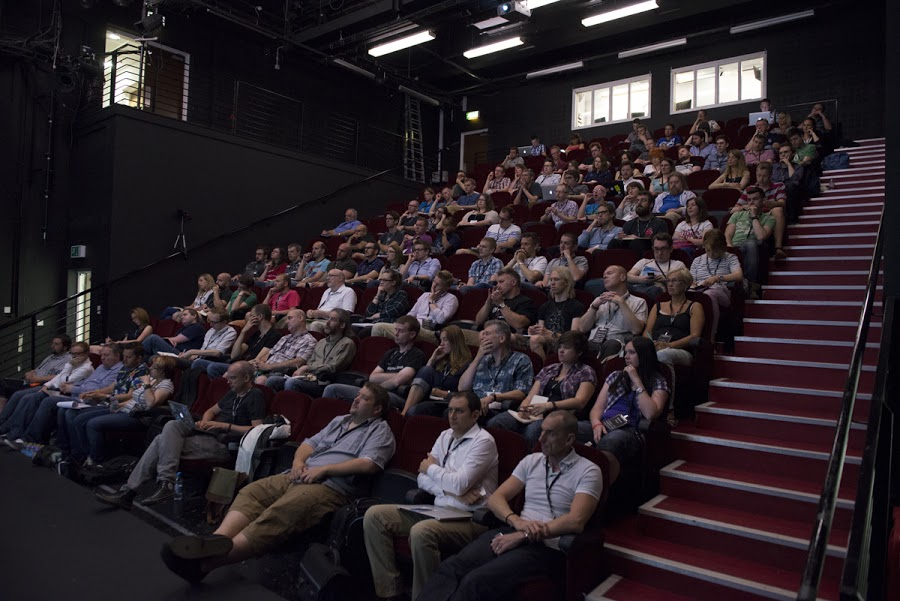
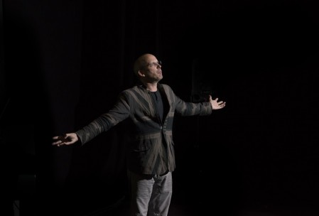
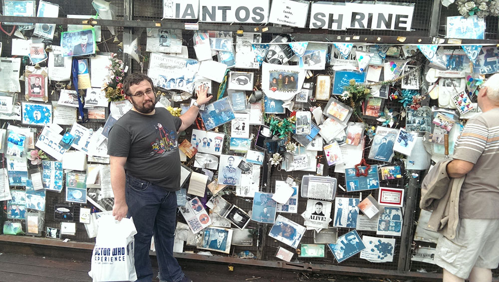

Naturally we wanted a part of The Business of Web Design and their gathering of the great and the good in Wales!
<!-- end -->

Joel Hughes had given me a complimentary t-shirt for just such an occasion  prior to our migration over the Severn Bridge!

Anyhow, upon arriving in Cardiff the evening before, we had a quick change of shirt, shower and shave (not in that order!) and whisked ourselves off to ZeroDegrees. This was the trendy bar venue for Second Wednesday which is a meet up for digital and creative peeps usually held in Nottingham but making a special exception for the attendees of #tboWD. Here we saw the creative pre-event talks by Katherine Cory and Nicolas Alpi and had some top notch Cardiff cuisine (NOT yummy untraditional pizza!)

So the next day finally arrived and we were all revved up!

© CWC Imagery

 

Every talk was animated, hugely informative and had a personal touch. The atrium was packed to the brim and at one point we even had our seats stolen by some disreputable hooligans! The eagle eyed of you may be able to spot us before the travesty occurred:

© CWC Imagery

 You may look at the photo above and think that Alex Ward is only listening to the talks but he is actually winning a [competition](http://www.kirstyburgoine.co.uk/dudeneedsaname-competition-winner/) as well. The wonderful talk by Kirsty Burgoine finished with a challenge: #dudeneedsaname and Alex had the brainwave of “Bolt” or more formally his alter ego “BoltON” for Kirsty’s robot dude! We were thrilled that we could help out, everyone adored Kirsty and she really knew her audience – her presentation included Star Wars clips and cats, it was a slam dunk!

It would be nice and fair to detail every talk but there are simply too many so we have narrowed our favorite speakers down to three:

## Danny Bluestone

Danny’s vision was breathtaking and substantial incorporating global philosophies such as Jidoka, Heijunka and Kaizen, as used by hugely successful companies such as Toyota. He emphasized the importance of quality and balance within Digital Agencies. At my company, we are obsessed with the former but this talk has given us an unlimited volume to think about – a core component was continual improvement!

If we are making it sound complex – well, it kinda is – the concepts are technical quality assurance, six sigma concepts but were combined in this talk with the importance of enjoying your work and having fun. Cyber-Duck’s methods, as described, marry both with streamlined systems and investment in staff. We will use this to inform our vision now and in the future.

## Paul Boag

From the opening slide Paul had the atrium in palm of his hand and his humour kept us all on the edge of our seats. His ability to tune in to the exact thoughts of everyone in the room made him a truly phenomenal speaker, coupled with his uncanny ability to see from the converse perspective of the client and how to meet their needs in the most professional manner.

Paul’s candid approach was simply terrific, he gave the detailed information everyone was hoping for – with very useful examples. He was the perfect final speaker – energizing and insightful. If you get a chance to see him I advise that you go.

## Viviana Doctorovich

Viviana’s talk focused on how to provide exceptional client service through tailored communication and full client involvement. It was wonderful to see how driven she was to ensure that the products she handed over to her clients were exactly as they expected and wanted.

We were inspired by her passion and suggestions for increased collaboration at the beginning of the website design process. Her solution offered clients who felt incredibly involved in constructing their product and therefore delighted with the finished result of the team effort. We are incorporating some of the methods she described into our own ways of working.

So many wonderful ideas discussed and a huge list of new innovations– what a wonderful way to wrap up the week! Many thanks to Joel Hughes for organizing such a successful event and to Paul Cornish of CWC Imaginery who provided all the photos.

Before we leave I think there might be one last thing my husband wanted to do, something to do with one of the [longest running TV shows ](http://www.bbc.co.uk/doctorwho)in the world and a commemorative wall…

