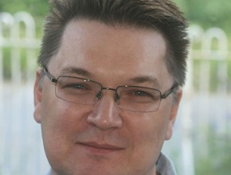

The speakers were top notch, the whole event ran impeccably and the after party served cocktails; need we say more?

<!-- end -->

It was actually quite a tall order as it was a very long day – starting at 5am to set off from Hampshire (Why no overnight hotel? A poorly cat booked into the vets for an anaesthetic the day before.)

From our arrival at the venue it went like a dream – Kirsty Burgoine really did think of everything; even having a man at the car park to greet you and open the barrier for you. There were eight talks scheduled in total, too many to discuss at length so we’ll list our fav four:

## Andy Yates

## 

Andy gave a candid talk about his company’s experience when they were hacked. He provided comprehensive advice about managing this scenario, the PR aspects and the follow up work. This was a wonderful example of transparency and integrity. Their blog has their [response](http://open.bufferapp.com/buffer-has-been-hacked-here-is-whats-going-on/#update4). Andy had everyone in the palm of his hand; his talk was engaging and essential!

## Amy Thibodeau

Amy gave us an insight into the subtleties of content and the subliminal effect words can have on us all. She also gave us some pointers on extra tools that you can use to simplify your content and make it even more accessible. She took ‘usability’ to a new extreme – Fascinating and useful! There is [more](http://writelikeahuman.com/) by Amy if you are interested.

## Andy Davies
 

Andy introduced many delegates to the world of HTTP/2 and its goal of basically reducing webpage load time. He explained how it was designed to achieve this through loading page elements in parallel, along with header compression and greater control over server pushes. Andy’s talk was sophisticated and intensive! If you would like to see for yourself here is the [presentation](http://www.slideshare.net/AndyDavies/http2-whats-it-all-about).

## Paul Boag

Paul made an impassioned case that businesses need to transform their business model to function well in the digital age. His talk gave examples of businesses disasters and triumphs. Our favourite was the example of Sarah Parmenter’s Blushbar, using technology to deliver more choice and a personal touch. Paul’s talk was Inspiring! There is a different [presentation](http://vzaar.com/videos/1634437) around the same theme online.

It was especially nice that all of the speakers made it to the after party – considering that this was 2 hours after the event finished this was quite a feat and a testament to how fun the day was. This was the most informative and enjoyable event so far this year!http://bit.ly/1IL3qO0)