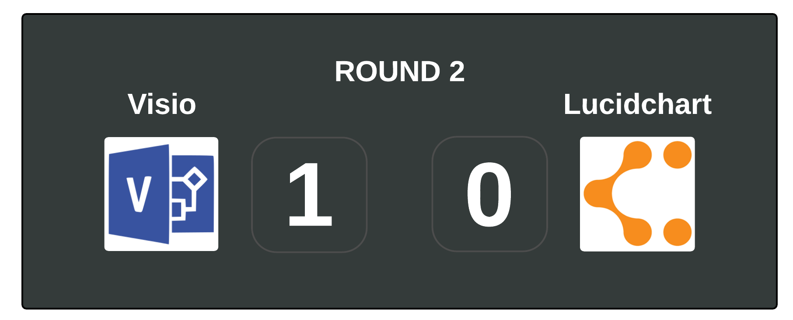
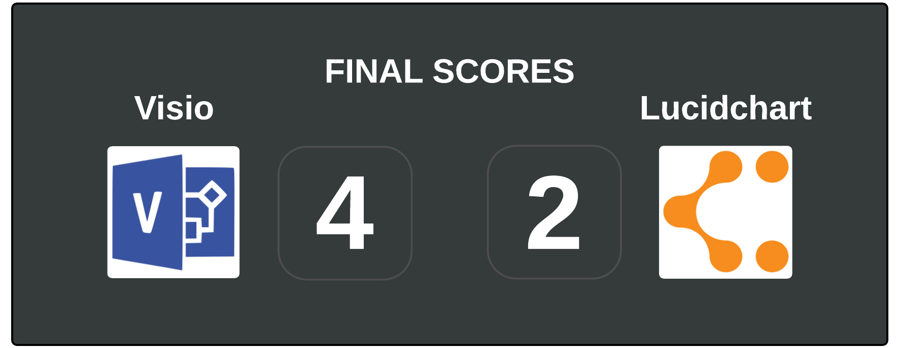

Microsoft Visio and Lucidchart may look like identical twins in different outfits. But here I explain the basic differences (and vent my grievances!)

Full disclosure: I am not cool enough to have any relationship with Lucidchart nor am I important enough to have a relationship with Microsoft. It’s just little old me; with my precious impartiality.

## Hardware

Oh Microsoft. We just can’t let go and accept that it is 2015 can we? But by ignoring the Apple market and failing to make Microsoft Visio available on other platforms you are forcing me to start this blog on rather a bum note. If you have a Mac of any kind this post is over – it’ll be Lucidchart all the way for you (unless you want to install Parallels or dual-boot, or something equally complicated!)

Lucidchart is web-based and so can be run on Macs and PCs.

## Working From Home / En Route

As Microsoft Visio has to be locally installed / downloaded it does mean that the perks and perils of restricted use come with this. You want to do a little extra work on your home computer? That’s not possible unless you install Visio on that too – but your employer might actually see your home computer as a security risk and prefer things this way.

On the other end of the spectrum we have cloud based Lucidchart and it can be accessed from wherever - as long as you have internet access. You will need to be on the Internet when you start since you can only access Lucidchart documents in the cloud and open the software in the cloud. You also need to be on the internet to save the document – so in practice you aren’t going to be using Lucidchart on the train unless you really want to take your chances by either:

- keeping it open on your laptop until you reach civilisation to connect and save or;
- trying to ‘catch’ the train’s ropey Wi-Fi to save it online.

I really don’t recommend either as we all know how frustrating it is to lose work.

**Update:** You could try beforehand to install the Chrome app for Lucidchart which would let you save and edit your files offline - if your company's firewall doesn't freak out and block it.

One last interesting point: what if your company really likes storing documents on their own servers – as most corporations do? How do you save your Lucidchart documents locally? You download them as Visio files, you can then upload the Visio files back into Lucidchart later when needed – see what I mean about twins?

]

## Company Politics

In the real world, many corporations rely on Microsoft and already have licensing agreements for their basic packages. I am not sure I would say it is brand loyalty or even reliability that makes companies enlist Visio rather than Lucidchart. I think it is the ease of using the same supplier and the lack of time/incentive to look elsewhere that leads them by the hand to Visio.

This has an unfortunate consequence; if someone asked me which application they should learn to make them more appealing to the jobs market I would *want* to say Lucidchart. They can have their own personal account for free, which in effect makes it portable as it can follow them from job to job and they can learn it for free by playing with it. But I would have to recommend they learn Microsoft Visio. The reality is Microsoft Visio software is the dominant player on most projects and I have yet to see a job listing asking for Lucidchart experience. Although I would emphasise that the similarity between both packages means that having experience of one you should make you eligible for a role requesting either Visio or Lucidchart.

## Processes and Organisation Charts

These are the bread and butter of most Visio / Lucidchart users; especially in the corporate world. Both packages have features that allow a user to select a specialist template promising to do most of the work. However, this is sometimes a little unrealistic. Many users have a list of competing tasks that need to get done immediately so in the real world they are going to open a blank template and start pulling across shapes rather than take time to research the best method of execution. I am not saying this is the best way to do it - it really isn’t, but I guarantee it is what will happen.

All the core functions you need to draw charts and insert photos are available and pretty much identical across both software packages. The only thing that differs is the naming conventions and routes to those functions.

Lucid chart would argue that their interface is easier to use. This is difficult for me to comment on. I underwent online training to appreciate the finer points of Microsoft Visio many years ago. I now use Lucidchart (as I use a Macbook) and have not undergone any advanced tutorials to do this *but* I do regularly have to look up how to do new tasks - an unfamiliar interface is always a bit of a puzzle.

Although it could be argued that Visio is more complicated, it is also presented in the frame of a Microsoft layout. So no matter how much you dislike it, you will be familiar with it, which gives you a head start. Whichever you use there will be a random task you need to do that is not evident and needs researching. I can only say that it is a personal preference issue. There are free trials available for Visio and a free online subscription available on Lucidchart. I would encourage registration for these to find out which one fits better with your own way of working.

## Performance

This is where Lucidchart loses points.

Over the past year I have used Lucidchart for straightforward diagrams such as product specifications without hyperlinks, page links or photos – really basic stuff. However the system often pauses everything while it struggles to autosave my work. This happens at random intervals approximately every 40 minutes and means that all my work in Lucidchart is halted for about a minute, sometimes more. It’s mildly annoying but not a deal breaker. Also, I should mention that I have not encountered this issue over the past month or so and it may have been patched - I have really tried to replicate this issue recently and have not been able to do so.

But don’t celebrate its newfound reliability just yet. Whilst testing the functions I encountered another bug. I was trying to crop a photo. The screen should have looked like this:

But when I attempted to crop the other photo with the red background (by right clicking on it) the software could not detect the photo and I encountered the screen below. Anyone can have a slip up, so I deleted the photo and uploaded it again but with the same result:

 

Subsequently on a different day Lucidchart relaxed and decided it would allow me to crop the photo but this would have been a problem if I was producing an organisation chart to a deadline. In a busy office this often happens as they will draw up/change an organisation chart last minute to show a client the team that has been hand-picked for them using the latest information.

## Final Verdict

Lucid chart is the dream. It works on everything, it provides its basic package for free and it has a simpler look. However in the real world it is up against the ultimate heavyweight: Microsoft. Their use in the corporate world is endemic and their ways of working are familiar to everyone. Most importantly they have the resources and backing to provide a software package that is pretty reliable in comparison.

Lucidchart is a wonderful alternative to Microsoft Visio but it has not quite surpassed the market leader at this moment in time. It is a shame as their pricing is better and their customer service is second to none. A few months ago when I asked to downgrade my subscription - after having paid the renewal subscription - they suggested an alternative package that was a lot cheaper and immediately refunded the difference. This compares to Microsoft who have a terrible attitude even when you are calling to pay an invoice. Microsoft has won on points but points aren’t everything.

Pull your socks up Lucidchart – everyone is rooting for you! 

